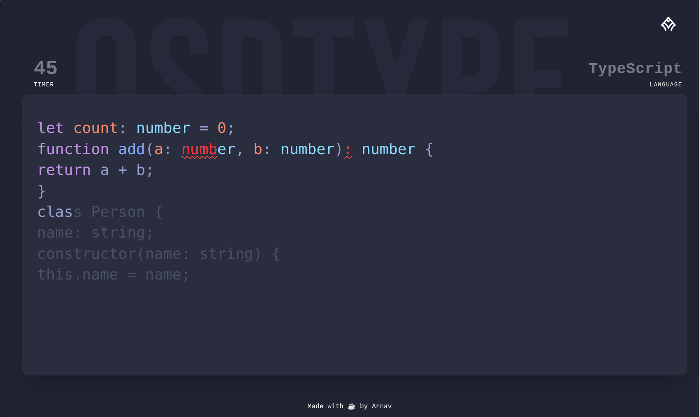

# OSDType
Speedtyping, but for Coders.

---

## 🚧 Project Status
This project is currently **under development**.  
Stay tuned — **V1 dropping soon!**

---

## ✨ Features
- **Live keystrokes:** WebSocket-based storage and replay of every typing session.  
- **Decoupled Anti-Cheat:** Detects copy-pasting and automated typing.  
- **Rooms:**  
  - Create private or public rooms with friends.  
  - Compete in real-time.  
  - Join as a player or viewer and watch live keystrokes being streamed.  
  - Great for organizing events and competitions.  
- **GitHub-based login only** → built *by developers, for developers*.  

---

## 🛠 Tech Stack
- **Frontend:** Svelte  
- **Backend:** Golang  

---
