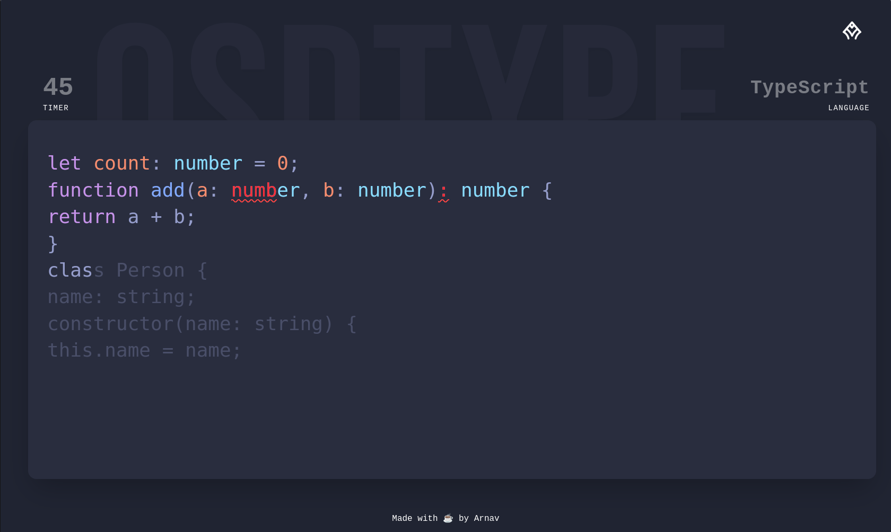

# OSDType

Speedtyping, but for coders.



A multiplayer typing arena. The snippet is real source code in one of six
languages, every keystroke is measured as it lands, and an Elo rating keeps
finding you opponents worth beating.

---

## Features

- **Live keystrokes** — WebSocket-delivered, per-keystroke WPM and accuracy,
  broadcast to every player and viewer in a match.
- **Ranked matchmaking** — players are paired by a rating-tree matchmaker, and
  the result feeds back into an Elo update.
- **Scheduled contests** — a room, a time, a language and a duration; the
  scheduler opens a lobby, runs the game, and publishes the leaderboard.
- **Rooms** — public or private, with owner / moderator / member roles,
  invites, blocking, and promotion.
- **Anti-cheat** — keystroke timing and accuracy are scored to separate a human
  from an automated typer.
- **GitHub OAuth login** — built by developers, for developers.
- **Snippet generation** — a Rust service parses the ANTLR grammars for each
  language and emits a random, typeable program.

---

## Architecture

```
app/        SvelteKit 5 frontend (Svelte 5 runes, Tailwind v4)
server/     Go 1.24+ API, game loop, matchmaking, scheduler
codegen/    Rust snippet generator (ANTLR grammars -> wasm/native service)
```

The Go server owns four things:

| Package                    | Responsibility                                                        |
| -------------------------- | --------------------------------------------------------------------- |
| `app/api`                  | gin routes, JWT auth, CORS, WebSocket upgrade                          |
| `app/services`             | business logic between the handlers and the database                   |
| `app/core`                 | matchmaker, scheduler, lobbies, the game loop, anti-cheat, bots        |
| `app/internal/postgresql`  | GORM models, migrations, queries                                       |

Requests follow `api` → `services` → `internal/postgresql`. A live match runs
entirely in memory: the `core` layer opens a `GameHandler`, which drives one
`Player` goroutine per participant and a broadcaster that fans keystroke deltas
out over the WebSocket. When the round ends the handler returns a leaderboard
on a channel that the matchmaker (2-minute budget) or the scheduler
(10-minute budget) reads to update ratings and contest state.

Configuration is a TOML file at `server/boot/config.toml`, read through viper.
`JWTKEY` comes from the environment.

---

## Getting started

### Prerequisites

- Go 1.24 or newer
- Docker (for Postgres)
- Rust, for the snippet generator
- bun (or npm) for the frontend

### Run it

```sh
just dev
```

That opens a tmux session with four panes: the database, the Go server
(with `air` hot reload), the codegen service, and the frontend. Frontend on
`:5173`, API on `:8080`, codegen on `:8081`.

To run the pieces separately:

```sh
just db-up                  # Postgres on :5432
cd server && JWTKEY=dev go run .
cd codegen && cargo run
cd app && npm run dev
```

`just` lists every recipe; `just --list` if you want them all up front.

### A note on the dev database

The `docker_data` volume is checked in and predates the current models. It
still has `users.email` and `users.password_hash` as `NOT NULL` columns with no
default, which nothing in the current model writes, and a handful of tables
(`bookings`, `payments`, `otps`, …) belonging to an earlier design.
`AutoMigrate` only ever adds columns, so the stale ones linger. If registration
fails with a not-null violation, or a query names a column you know exists,
`just db-reset` drops the volume and starts clean.

The integration suite is immune to this: it runs against a throwaway database
whose schema is created from the current models.

---

## Testing

Two suites, selected by build tag:

| Tag          | What it covers                                                    | Needs a database |
| ------------ | ----------------------------------------------------------------- | ---------------- |
| `unit`       | Pure logic: Elo, WPM, PRNG, id generation, entity enums, JWT      | no               |
| `integration`| Real HTTP handlers, real GORM queries, the scheduler loop          | yes              |

```sh
just test-unit              # no database required
just test-db-up             # throwaway Postgres on :5433
just test-all               # unit + integration
just ci-test                # boot the throwaway DB, run everything, tear it down
just cover                  # coverage summary
```

The integration database is deliberately on port **5433**, separate from the
dev database on 5432, so running the suite can never destroy your dev data.
`docker-compose.test.yml` runs it on tmpfs — it is thrown away on exit.

Connection settings come from the environment, with defaults that match the
throwaway database: `TEST_DB_HOST`, `TEST_DB_PORT`, `TEST_DB_USER`,
`TEST_DB_PASSWORD`, `TEST_DB_NAME`, `TEST_DB_SCHEMA`.

Each `go test` binary gets its own Postgres **schema**, derived from the test
binary's own name and wired up through the `DB.search_path` config key. `go
test` runs package binaries in parallel, and without that the packages would
delete each other's rows mid-test.

### Linting

```sh
just lint          # vet + gofmt + golangci-lint over the whole server tree
just lint-app      # prettier + eslint
just check-app     # svelte-check
```

`golangci-lint` is configured in `.golangci.yml` (v2 schema). One thing worth
knowing: the linter bundles its own copy of `go/types` and refuses to load
source that needs a newer language version than the Go it was built against. CI
pins `GO_VERSION` and `GOLANGCI_LINT_VERSION` together for that reason, and
`just lint` sets `GOLANGCI_GOTOOLCHAIN` to the matching toolchain. If you bump
one, bump the other. Override locally with `GOLANGCI_GOTOOLCHAIN=local`.

---

## CI

`.github/workflows/ci.yml` runs on every push and pull request to `main`, in
five parallel jobs:

| Job                | What it does                                                            |
| ------------------ | ----------------------------------------------------------------------- |
| `build`            | `go mod tidy` diff check, then builds with and without the test tags      |
| `lint`             | `go vet`, `gofmt`, `golangci-lint`                                      |
| `unit-test`        | `go test -short -tags=unit -race`, coverage profile uploaded             |
| `integration-test` | Postgres service on 5433, `go test -tags=integration`, coverage uploaded  |
| `frontend`         | bun install, lint, `svelte-check`, build                                |

---

## Project layout

```
├── app/                  SvelteKit frontend
│   └── src/routes/       /, /login, /play, /play/me, /play/ranked, /hub
├── codegen/              Rust snippet generator
├── server/               Go backend
│   ├── app/
│   │   ├── api/          gin handlers, auth middleware
│   │   ├── core/         matchmaker, scheduler, game loop, anti-cheat
│   │   ├── entity/       GORM models and shared types
│   │   ├── internal/     postgresql, redis, test helpers
│   │   ├── services/     business logic
│   │   └── utils/        WPM, Elo, PRNG, ids, codegen client
│   ├── boot/config.toml  configuration
│   └── main.go
├── .github/workflows/ci.yml
├── .golangci.yml
├── docker-compose.yml        dev database, :5432
├── docker-compose.test.yml   throwaway test database, :5433
└── justfile
```

---

## License

MIT. See [LICENSE](LICENSE).
